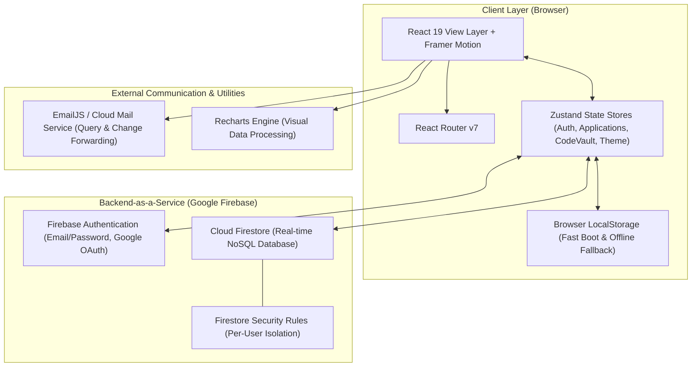
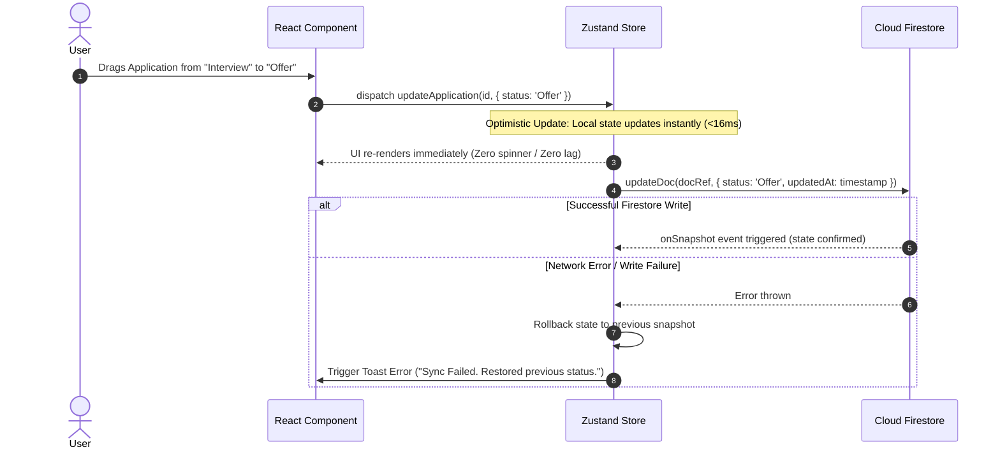

# 🏛️ JobTracker - Comprehensive System Design Document

This document outlines the end-to-end architecture, data flow, technical decisions, and design patterns powering **JobTracker** — a full-featured, real-time career management and job search optimization platform.

---

## 1. High-Level System Architecture

JobTracker is designed as a **Single Page Application (SPA)** with a cloud-native, serverless backend. It combines high-speed client-side rendering with real-time distributed data storage and edge communication services.



---

## 2. Client-Side Architecture & Component Hierarchy

The application follows modular component-driven development with clear separation between **Presentation**, **State**, and **Services**:

```
src/
├── components/          # Reusable, self-contained UI components
│   ├── analytics/       # Charts, metrics cards, conversion funnels
│   ├── applications/    # Kanban boards, modals, status tags, rejection logs
│   ├── layout/          # AppShell (Sidebar, Topbar, Mobile Navigation)
│   ├── journal/         # Code question vault, star tags, code viewers
│   └── ui/              # Toast notifications, dialogs, drawers, badges
├── firebase/            # Firebase SDK client, firestore CRUD, auth handlers
├── hooks/               # Custom hooks encapsulating async data subscriptions
│   ├── useApplications.ts
│   ├── useContacts.ts
│   ├── useCodeQuestions.ts
│   └── useDebounce.ts
├── pages/               # Top-level route pages (20+ dedicated views)
├── store/               # Lightweight Zustand atomic stores
└── types/               # Strict TypeScript domain interfaces
```

### Layout Hierarchy
- **`AppShell`**: Wraps all authenticated pages. Provides responsive navigation (collapsible sidebar on desktop, sticky command hub on mobile), theme toggle, breadcrumbs, and live sync indicators.
- **`ProtectedRoute`**: Verifies `useAuthStore.user`. Redirects unauthenticated visitors to `/login` while preserving the intended target URL.

---

## 3. Data Flow & Real-Time Synchronization Pattern

JobTracker utilizes an **Optimistic UI with Reactive Server-Sync** pattern:



### Why Real-Time Listeners (`onSnapshot`) Over Polling?
- **Zero Refresh Required**: When a user updates data on mobile or another tab, updates appear in milliseconds.
- **Bandwidth Efficient**: Only document diffs are transferred, rather than re-fetching entire lists.
- **Memory Safety**: Every subscription returns an `unsubscribe` function executed during React component unmount (`useEffect` cleanup) to prevent memory leaks.

---

## 4. State Management Strategy

We use **Zustand** combined with targeted **LocalStorage Persistence**:

| Store | Purpose | Sync Strategy |
| :--- | :--- | :--- |
| **`authStore`** | Authenticated user session, token state, profile | Firebase Auth listener (`onAuthStateChanged`) |
| **`applicationStore`** | User's job application pipeline and Kanban states | Real-time Firestore subscription (`subscribeToApplications`) |
| **`codeVaultStore`** | Stored interview questions, solutions, and notes | Dual-layer (Firestore real-time + local Zustand cache) |
| **`themeStore`** | Light / Dark mode UI tokens | LocalStorage persistence (`joborbit_theme`) |

### Clean Slate Guarantee for New Users
- When a new account is registered, stores initialize with empty collections (`[]`).
- No fake records, dummy code questions, or placeholder PDF links are written to the user's database.
- Clean empty states guide first-time users to create their first real application or document.

---

## 5. Database Schema & Data Models

Cloud Firestore stores documents under isolated user subcollections: `users/{userId}/{collectionName}/{documentId}`.

### 5.1 Job Application (`applications`)
```typescript
interface Application {
  id: string;
  userId: string;
  company: string;
  role: string;
  status: 'Wishlist' | 'Applied' | 'Screening' | 'Interview' | 'Offer' | 'Rejected';
  appliedDate: string;           // ISO format 'YYYY-MM-DD'
  salaryMin?: number;
  salaryMax?: number;
  location: string;             // e.g. "Remote", "New York, NY"
  workModel: 'Remote' | 'Hybrid' | 'Onsite';
  jobUrl?: string;
  notes?: string;
  rounds?: InterviewRound[];
  rejectionReason?: string;
  createdAt: string;
  updatedAt: string;
}
```

### 5.2 Interview Code Question (`codeQuestions`)
```typescript
interface InterviewCodeQuestion {
  id: string;
  userId: string;
  title: string;
  company: string;
  round: string;                 // e.g. "Technical Round 2"
  difficulty: 'Easy' | 'Medium' | 'Hard';
  topic: string;                 // e.g. "Data Structures & Design"
  language: 'javascript' | 'typescript' | 'python' | 'java' | 'cpp' | 'go' | 'sql';
  code: string;
  approach: string;
  timeComplexity: string;
  spaceComplexity: string;
  followUps?: string;
  isStarred: boolean;
  dateAdded: string;
}
```

### 5.3 Networking Contact (`contacts`)
```typescript
interface Contact {
  id: string;
  userId: string;
  name: string;
  company: string;
  role: string;
  email?: string;
  linkedIn?: string;
  status: 'Contacted' | 'Coffee Chat' | 'Referral Submitted' | 'Follow Up Needed';
  notes: string;
}
```

---

## 6. Security, Privacy & Compliance Architecture

### 6.1 Firestore Security Rules
All queries enforce authentication and user-level isolation at the database layer:
```javascript
rules_version = '2';
service cloud.firestore {
  match /databases/{database}/documents {
    match /users/{userId}/{document=**} {
      allow read, write: if request.auth != null && request.auth.uid == userId;
    }
  }
}
```

### 6.2 Private Feedback & Query Dispatch
- When users submit questions or feedback from the About section, inquiries are routed securely via an email relay service (`EmailJS` / Cloud API).
- **Target Privacy**: The destination mailbox (`deepith1718@gmail.com`) is protected through secure environment variables and relay templates — **never** rendered directly in client HTML or plain text strings.

---

## 7. Performance & Optimization Highlights

1. **Vite Optimized Chunk Splitting**:
   - High-weight vendor modules are isolated into separate cacheable chunks:
     - `vendor-react`: React, ReactDOM, React Router
     - `vendor-charts`: Recharts, D3 utilities
     - `vendor-firebase`: Firebase Auth & Firestore
     - `vendor-motion`: Framer Motion animations
     - `vendor-dnd`: Drag and Drop engine
   - Result: Initial page load is lightweight (~40 KB CSS, small fast-loading JS entry).
2. **Debounced Computations**:
   - ATS keyword search, filter inputs, and real-time calculation formulas use debounced event handling to eliminate main-thread stuttering.
3. **Hardware-Accelerated Transitions**:
   - Card dragging and status transitions use CSS `transform: translate3d()` via Framer Motion to prevent layout reflows.
